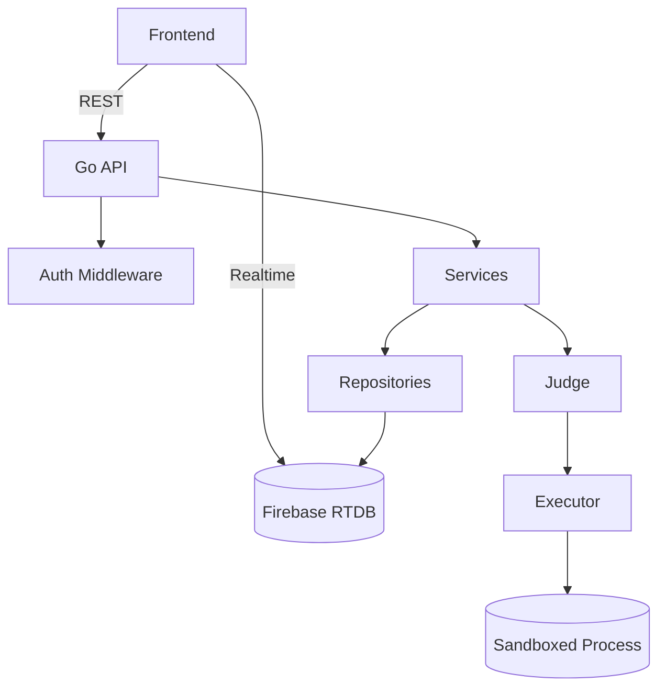

# JudGO

JudGO is a competitive programming platform built for real-time play.

It combines:

- A fast Go backend (Clean Architecture)
- Real-time state and sync using Firebase RTDB
- A modern React frontend optimized for coding duels and practice

## Key advantages

| Area | What JudGO does better |
|---|---|
| Real-time duels | Room-based matches where progress updates live, designed for competitive sessions |
| Product UX | Integrated arena + practice + dashboard with a consistent, modern UI |
| Backend speed | Go services with clear separation of domain, service, repo, and transport layers |
| Data model | RTDB-first design for instant updates and multiplayer state |

## Feature overview

| Feature | Notes |
|---|---|
| Practice submissions | Attempts tracking and solved state |
| Dashboard statistics | Aggregated stats from real user activity |
| Multiplayer rooms | Lobby, countdown, and room game lifecycle |
| Multi-task room games | Multiple problems per game, per-user progress |
| Judge pipeline | Dev-mode judging available; production isolation is a separate hardening step |

## Architecture

| Folder | Responsibility |
|---|---|
| `cmd/` | App entry points |
| `internal/domain/` | Business models |
| `internal/service/` | Use cases and business rules |
| `internal/repository/` | Firebase RTDB persistence |
| `internal/transport/rest/` | HTTP routes, handlers, middleware |
| `pkg/` | Reusable packages (sandbox runner, firebase client) |

## Comparison

| Platform | Focus | What JudGO adds |
|---|---|---|
| LeetCode | Interview practice | Real-time competitive rooms and arena-style duels |
| Codeforces | Contests | Product-grade UX, integrated dashboard, and persistent practice flow |
| HackerRank | Skill testing | Real-time room gameplay and a unified competitive experience |

## Project ownership and anti-plagiarism

This repository is the original work of **Alish Akadil**.

You may not:

- Copy, re-upload, resell, or redistribute this project (or substantial parts of it)
- Present this code as your own work
- Use it for academic submission or plagiarism

If you want to use any part of this project, request explicit permission from the author.

## Author

| Name | Role | GitHub |
|---|---|---|
| Alish Akadil | Creator | https://github.com/AQADIL |

---

 2026 JudGO. All rights reserved.